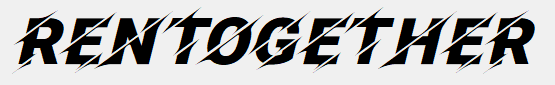

<div id="top"></div>
<!--
*** Thanks for checking out the Best-README-Template. If you have a suggestion
*** that would make this better, please fork the repo and create a pull request
*** or simply open an issue with the tag "enhancement".
*** Don't forget to give the project a star!
*** Thanks again! Now go create something AMAZING! :D
-->


<!-- PROJECT SHIELDS -->
<!--
*** I'm using markdown "reference style" links for readability.
*** Reference links are enclosed in brackets [ ] instead of parentheses ( ).
*** See the bottom of this document for the declaration of the reference variables
*** for contributors-url, forks-url, etc. This is an optional, concise syntax you may use.
*** https://www.markdownguide.org/basic-syntax/#reference-style-links
-->
[![MIT License][license-shield]][license-url]

<!-- PROJECT LOGO -->
<br />
<div align="center">
  <a href="https://github.com/Xynorimas/ICT1009-CPP-RenTogether">
    
  </a>

<h3 align="center">Project RenTogether</h3>
  <p align="center">
    A C++ application, developed using QT Framework for GUI and coded to demonstrate simple OOP concepts through simulating a car rental application.
    <br />
  </p>
</div>

<!-- TABLE OF CONTENTS -->
<details>
  <summary>Table of Contents</summary>
  <ol>
    <li>
      <a href="#about-the-project">About The Project</a>
      <ul>
        <li><a href="#built-with">Built With</a></li>
      </ul>
    </li>
    <li>
      <a href="#getting-started">Getting Started</a>
      <ul>
        <li><a href="#prerequisites">Prerequisites</a></li>
        <li><a href="#installation">Installation</a></li>
      </ul>
    </li>
    <li>
      <a href="#Importing-Project-to-Qt-IDE">Importing Project to Qt IDE</a>
      <ul>
        <li><a href="#Opening-project">Opening project</a></li>
        <li><a href="#installation">Installation</a></li>
      </ul>
    </li>
    <li><a href="#usage">Usage</a></li>
  </ol>
</details>


<!-- ABOUT THE PROJECT -->
## About The Project
A simple Car Rental Application, coded in C++ and developed using QT Framework by.

* [Wesley Chiau](https://github.com/wesleychiau)
* [Meng Rong](https://github.com/Xynorimas)
* [Shahzad](https://github.com/shahzad1999)
* [Xin Yi](https://github.com/xinyi-toh)
* [Jing Kai](https://github.com/jingkai2)
<p align="right">(<a href="#top">back to top</a>)</p>

### Built With
* [QT Framework](https://www.qt.io/download?hsLang=en)
* [Mingw-w64 - C++ Compiler on Windows System](https://www.mingw-w64.org/)
<p align="right">(<a href="#top">back to top</a>)</p>


<!-- GETTING STARTED -->
## Getting Started
This is an example of how you may give instructions on setting up your project locally.
To get a local copy up and running follow these simple example steps.

### Preequisites
Download Qt Framework on their [download](https://www.qt.io/download?hsLang=en) page
### Installation
1. Run the installer.exe
2. Login to Qt account
3. Allow it to Setup and retrieve meta data in its online repository
  ```
  Mirror installer (if connection service fails to establish on main repository)

  ./qt-unified-windows-x86-4.3.0-1-online.exe --mirror http://www.nic.funet.fi/pub/mirrors/download.qt-project.org
  ```

<div align="center">
    
</div>
<!-- ![Installation Folder][InstallationFolder] -->
<br />
  
4. Select Components in the installer
<div align="center">
    
</div>
<!-- ![QtLibrary][QtLibrary] -->
<br />

5. Finish the installation. Run Qt Creator 6.0.2 (Community)
<p align="right">(<a href="#top">back to top</a>)</p>


<!-- Importing Project for compiling-->
## Importing Project to Qt IDE
### Opening project
1. Open Qt Creator 6.0.2 (Community) - Windows Start Menu 
<br />

2. Click File tab and "Open File or Project"
<br />

3. Access the "RenTogether Src Files" folder, click on the RenTogether.pro file and let it build
<div align="center">
    
</div>
<!-- ![Open .pro file][ImportingProject] -->
<br />

4. Once done, click projects tab and click "Manage Kits..."
<br />

5. Click "Desktop Qt 6.2.4 MinGW 64-bit" and make sure to click "make default" button and apply
<div align="center">
    
</div>
<!-- ![Make Default Kit][DefaultMinGW] -->
<br />

6. Go to Projects --> Build Settings --> "add button" --> add a new release build profile
<div align="center">
    
</div>
<!-- ![Release Profile][ReleaseBuild] -->
<br />

7. Go to the bottom left, find the build profile from step 6, and click the new icon (not the run)
<div align="center">
    
</div>
<!-- ![New profile][mingwkit] -->
<br />

8. After building, copy ("RenTogether Src Files" --> data folder) and paste into (build profile folder) as shown in the image
<div align="center">
    
</div>
<!-- ![Data Folder][datafolder] -->
<br />

9. Project is finished setting up and click the play button to run the application
<p align="right">(<a href="#top">back to top</a>)</p>


<!-- USAGE EXAMPLES -->
## Usage
Use this space to show useful examples of how a project can be used. Additional screenshots, code examples and demos work well in this space. You may also link to more resources.

- [ ] To run the app, go "Compiled Build" --> run RenTogether.exe
<div align="center">
    
</div>
<br />

- [ ] To import the project into QT IDE (<a href="#installation">Import Section</a>), go "RenTogether Src Files" --> open RenTogether.pro in Qt IDE
<div align="center">
    
</div>
<br />

- [ ] The json files are stored in "data" folder
<div align="center">
    
</div>
<p align="right">(<a href="#top">back to top</a>)</p>


<!-- LICENSE -->
## License
Distributed under the MIT License. See `README_License.txt` for more information.
<p align="right">(<a href="#top">back to top</a>)</p>


<!-- CONTACT -->
## Contact
Wesley Chiau (Leader) - 2100751@sit.singaporetech.edu.sg <br />
Meng Rong (Readme Designer) - 2100657@sit.singaporetech.edu.sg <br />
Xin Yi (Readme Designer) - 2102453@sit.singaporetech.edu.sg

Project Link: [https://github.com/Xynorimas/ICT1009-CPP-RenTogether](https://github.com/Xynorimas/ICT1009-CPP-RenTogether)

<p align="right">(<a href="#top">back to top</a>)</p>


<!-- MARKDOWN LINKS & IMAGES -->
<!-- https://www.markdownguide.org/basic-syntax/#reference-style-links -->
[license-shield]: https://img.shields.io/github/license/github_username/repo_name.svg?style=for-the-badge
[license-url]: https://github.com/Xynorimas/ICT1009-CPP-RenTogether/blob/main/READMELicense.txt

[product-screenshot]: images/screenshot.png

[data]: images/data.png
[compiledBuild]: images/compiledBuild.png
[RentTogetherPro]: images/RenTogetherPro.png

[InstallationFolder]: images/InstallationFolder.png
[QtLibrary]: images/QtLibrary.PNG

[ImportingProject]: images/ImportingProject.PNG
[DefaultMinGW]: images/DefaultMinGW.PNG
[ReleaseBuild]: images/ReleaseBuild.PNG
[mingwkit]: images/mingwkit.png
[datafolder]: images/datafolder.PNG
